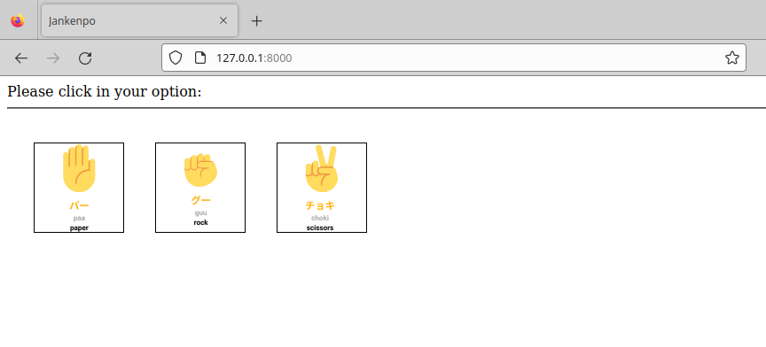

# Jankenpo Docker

In this simple project we run a Nginx image with the files to play Jankenpo with the logic (programming logic) in the frontend (javascript).

Steps:

See Dockerfile (in root directory).

You need to generate the image using the Dockerfile ("recipe"):

In the root directory (sudo in the command is necessary in Linux):

```
docker build . -t jankenpo-docker
```

In the previous step (as described in Dockerfile), we used the Nginx base image

In Dockerfile:
```
from nginx
```

Now we copy the files that are in the `files` directory:
```
copy files/* /usr/share/nginx/html/
copy files/assets /usr/share/nginx/html/assets/
```

To run the created image we can use this command:
```
sudo docker run -p 8000:80 jankenpo-docker
```

We:
- used the jankenpo-javascript image that we tagged in the build step
- we configured the port mapping: 8000 in your machine to 80 in the container.

Now if you access [http://127.0.0.1:8000](http://127.0.0.1:8000) you will see this page and play Jankenpo:



# Video showing the execution:

[https://www.youtube.com/watch?v=5ZElo6XY9jY](https://www.youtube.com/watch?v=5ZElo6XY9jY)